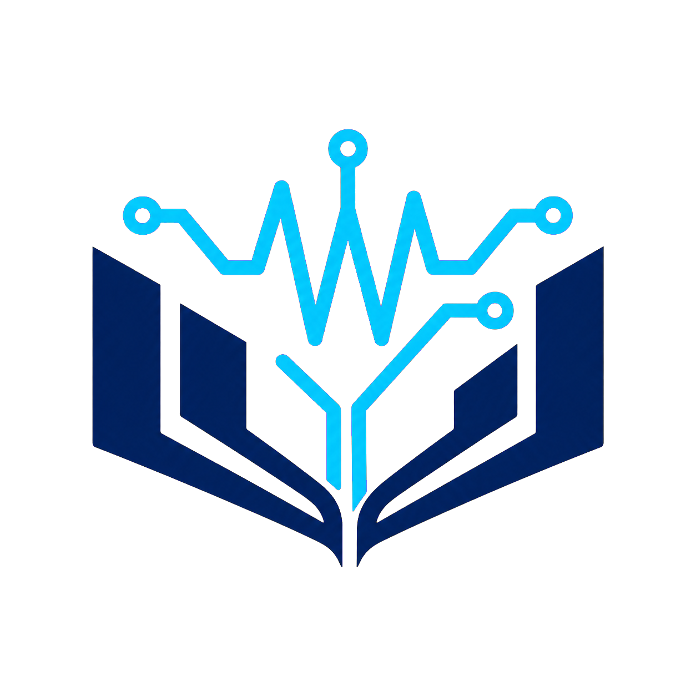

  

# 前言

欢迎来到 **EEDIY**。这里是一份面向电子工程学习者的系统化自学指南：从数学、物理与编程基础出发，逐步进入电路、信号、数字系统、控制、电磁场、能源、半导体等方向，并把公开课程落实为可以检查的练习、实验与项目。

电子工程的知识密度很高，方向之间又彼此依赖。面对海量课程，真正困难的通常不是“找一个视频”，而是判断先修关系、资源是否完整、练习能否形成反馈，以及实验是否适合当前的设备与安全条件。本网站因此把重点放在四件事上：

- **课程覆盖**：按学科方向整理公开课程，并区分主线、替代和补充资源。
- **路线规划**：用先修关系和阶段产出连接课程，而不是只给出一张课名清单。
- **项目实践**：每个阶段都要求设计、计算、仿真、测量或复盘的可验证证据。
- **持续核验**：记录开放材料、访问限制、硬件要求、风险边界和最近复核日期。

## 从哪里开始

你不需要先读完整个网站。选择最接近当前状态的入口，完成一个小闭环，再回来修订路线。

- 几乎从零开始：先完成[起步诊断](getting-started.md)，补齐代数、三角函数、微积分、基础物理和计算工具。
- 数学与物理基础尚可：从[数学基础](math-foundations.md)和[全局路线](roadmap.md)进入电路与信号主干。
- 已学过基础电路：浏览[课程总览](courses/index.md)，先各完成一个模拟、数字或嵌入式、信号或控制小项目，再决定深挖方向。
- 已有研究或求职目标：从[学习路线](routes/index.md)倒推最短先修链，并用[项目实践指南](guides/projects.md)组织证据。

## 电子工程不是一条直线

不同方向共享数学、物理、计算和测量基础，但各自沿不同的深度轴发展。先建立共同语言，再选择一到两个主方向，同时保留对其他方向的接口级理解。

| 方向 | 核心问题 | 典型完成证据 |
| --- | --- | --- |
| 电路与模拟电子 | 如何权衡噪声、带宽、功耗和非线性？ | 放大器、滤波器、电源与测量报告 |
| 数字系统与 FPGA | 如何把行为规格变成时序正确的硬件？ | HDL 模块、验证平台与时序报告 |
| 嵌入式与实时系统 | 硬件与软件如何在资源和时序限制下协同？ | 驱动、数据记录器与硬件在环测试 |
| 信号、通信与信息论 | 如何从不完整、有噪声的观测中恢复信息？ | DSP 流水线、链路预算与误码实验 |
| 控制与机器人 | 如何让动态系统稳定、可观测并达到目标？ | 系统辨识、控制器与闭环测试 |
| 电磁、射频与光子学 | 场和波如何在结构、介质与频率之间传播？ | 场仿真、天线或无源网络分析 |
| 电力与能源 | 如何安全、高效地转换、传输和管理能量？ | 变换器仿真、热分析与保护方案 |
| 半导体与集成系统 | 材料和器件如何形成可制造、可验证的系统？ | 器件模型、版图检查与 PVT 分析 |

[查看完整先修与分支图](roadmap.md)

## 如何判断一门课值得投入

每个课程页面都应当回答这些问题：

1. **学完能够做什么？** 学习成果必须可以解释、计算、设计、实现或测量。
2. **真正的先修是什么？** 区分硬性先修、可同步补充的知识和可选背景。
3. **公开了哪些资源？** 分别核对视频、讲义、题目、答案、实验、代码和考试。
4. **反馈从哪里来？** 没有答案或自动评测时，需要安排同伴评审、仿真或测量闭环。
5. **成本与限制是什么？** 显式记录付费墙、地区限制、旧软件、专用硬件和无障碍问题。
6. **最近何时核验？** 外部链接和开放政策会变化，陈旧信息必须明确标记。

等级描述的是**当前公开版本对独立学习的可执行性**，不是对学校、教师或学科价值的排名。

## 一次可持续的学习循环

1. **定义产出**：先写下本阶段要解释、计算、设计或测量的结果，再选择课程。
2. **获取最小理论**：通过讲义、视频和推导建立模型，并说明假设和适用范围。
3. **练习与实现**：先独立作答，再与答案、仿真或测试数据比较，分类记录错误。
4. **测量与复盘**：保留原始数据、版本、单位、不确定度和失败尝试，决定继续、补课或换路线。

!!! danger "先读安全指南，再接通电源"
    课程中出现实验，不代表它适合家庭环境。市电、储能电容、高功率电池、旋转机械、激光、射频功率与高温工艺都需要匹配风险的设施、训练和监督。无法确认边界时，只做仿真或使用经验证的低能量教学平台。开始前请阅读[实验安全指南](guides/safety.md)。

## 今天就开始

- 只有 30 分钟：完成[起步诊断](getting-started.md#start-diagnostic)。
- 有一小时：从[全局路线](roadmap.md)选择一个四周里程碑。
- 已经在上课：用课程页面检查当前课程缺少的反馈与项目环节。
- 已有项目想法：购买器件前先写[一页规格](guides/projects.md#project-spec)。
- 发现信息失效：按[贡献指南](contributing.md)提交带证据的更正。
